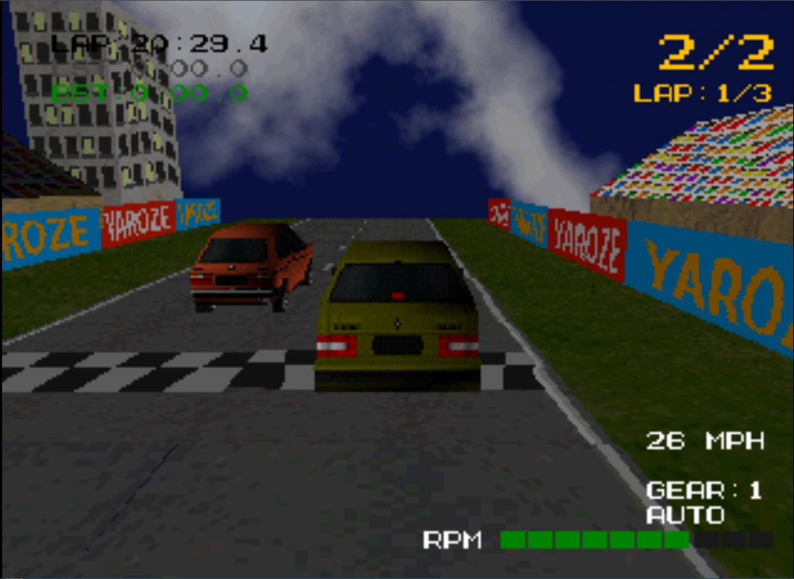
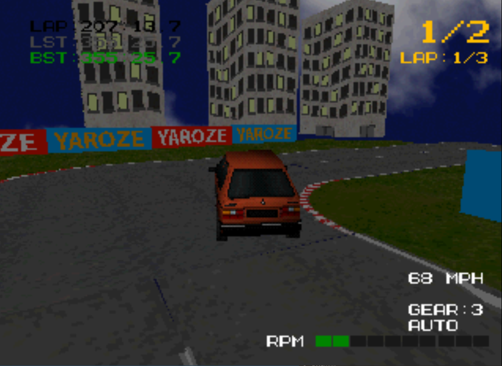
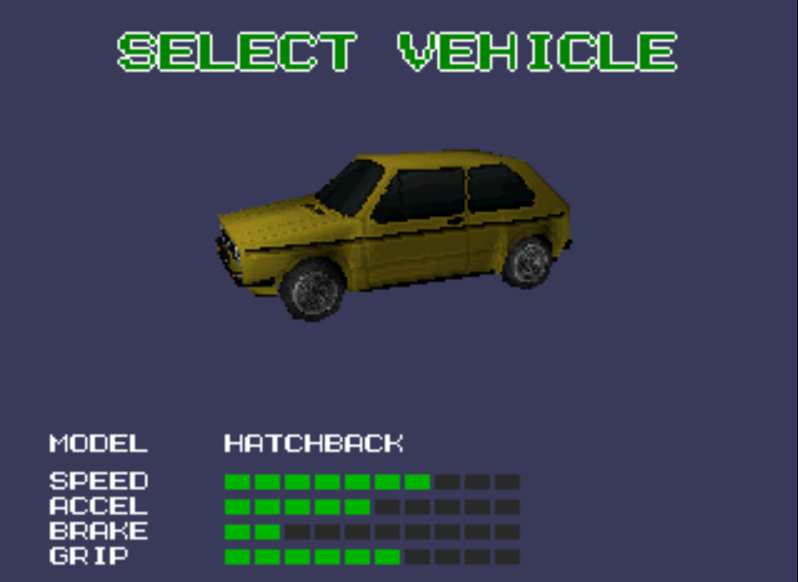
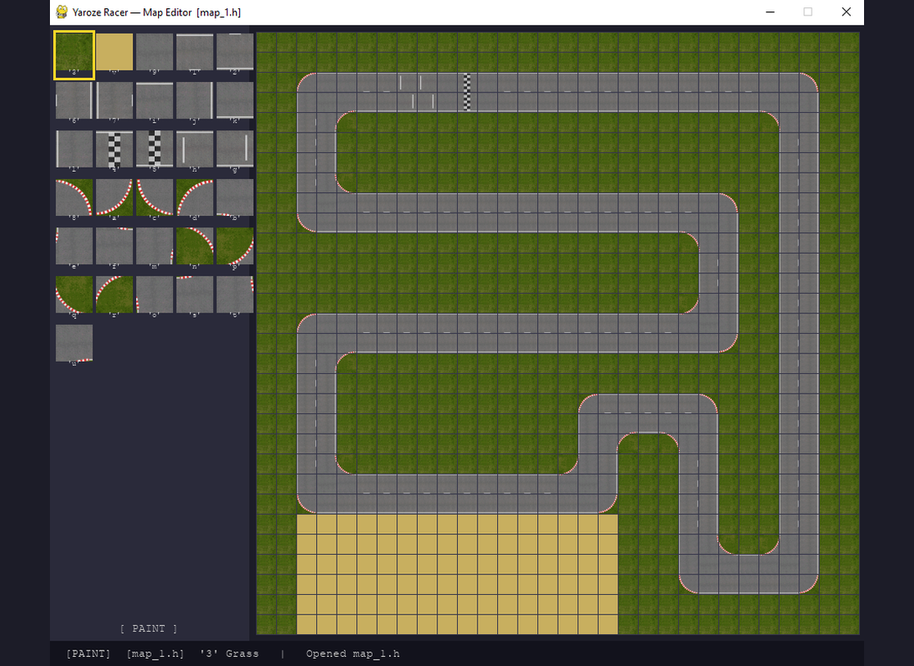

# Yaroze Racer

A 3D racing game for the PlayStation 1, built with the [Net Yaroze](https://en.wikipedia.org/wiki/Net_Yaroze) development kit.


---

## Overview

Yaroze Racer is a 3D racing game written in C targeting the original PlayStation hardware. It features three driveable vehicles, five AI opponents, a 3-lap race structure, split-screen multiplayer, memory card save support, and a Python-based track editor.

---

## Screenshots

<p align="center">
  
  
</p>
<p align="center">
  
  
</p>

---

## Features

- **Three vehicles** with auto/manual gearbox
- **Five AI opponents**
- **Race position tracking**
- **Lap counter**
- **Multiple camera modes**
- **Split-screen multiplayer**
- **Dynamic vehicle colours**
- **Brake lights**
- **Scrolling skybox**
- **HUD** speed, gear, lap timer, best/last lap, race position
- **Menu system**
- **Memory card support** 6 save slots with animated icons
- **Localisation framework** multi-language support
- **Track editor** Python/Pygame tool

---

## Platform

| Item | Detail |
|------|--------|
| Hardware | PlayStation 1 (Net Yaroze) |
| Language | C (C89) |
| SDK | libps (Net Yaroze PlayStation SDK) |
| Build tool | GNU Make + GCC cross-compiler |
| Audio formats | VAG / VAB / SEQ (PS1 native) |
| Model format | TMD (PS1 native) |
| Texture format | TIM (PS1 native) |

---

## Project Structure

```
yaroze-racer/
├── main.c               Entry point
├── Makefile             Build
├── auto                 Memory loader
├── memory_map.PSX       PS1 RAM layout
│
├── engine/              Core systems
│   ├── state_manager    Game state machine
│   ├── graphics         GTE/GPU rendering
│   ├── model            Model loading/drawing
│   ├── light            Lighting setup
│   ├── controller       Joypad input 
│   ├── audio            VAB/SEQ music and SFX
│   ├── font             Bitmap font rendering
│   ├── ui               UI primitives
│   ├── keyboard         On-screen keyboard
│   ├── message          Popup messages/prompts
│   ├── timer            Hardware timer
│   ├── memcard          Memory card save/load
│   ├── lang             Localisation strings
│   ├── link             Link play connection/handshake
│   ├── yario            YarIO: link cable data over TTY
│   └── yario_emu        YarIO TTY driver for emulators
│
├── game/                Game logic
│   ├── game             Physics
│   ├── player           PlayerStruct
│   ├── car_controls     Player input
│   ├── ai_racer         AI, pos, lap count
│   ├── link_race        Link race (2 consoles)
│   ├── vehicle_attribs  Per-vehicle tuning
│   ├── suspension       Suspension/body sim
│   ├── gear             Gearbox sim
│   ├── world            World rendering
│   ├── ground           Tile-based terrain
│   ├── sky              Scrolling skybox
│   ├── hud              In-race HUD
│   ├── brakelights      CLUT-swap effect
│   └── vehicle_colour   Body colour
│
├── states/              Game flow
│   ├── gameplay         Main race loop
│   ├── menu_main        Title / main menu
│   ├── menu_lobby       Link-game lobby
│   ├── menu_vehicle     Vehicle select
│   ├── menu_options     Settings screen
│   ├── menu_pause       In-race pause
│   ├── menu_memcard     Memory card browser
│   └── gameover         Results screen
│
└── tools/
    ├── map_editor.py    Track layout editor
    ├── png2tim.py       PNG to TIM texture converter
    ├── run-linked.ps1   Two linked emulators (make link)
    └── blender-rsd/     Blender 4.x RSD model exporter
```

---

## Building

### Prerequisites

- GCC cross-compiler targeting the PS1 (mipsel-unknown-elf or equivalent configured for libps)
- Net Yaroze `libps` SDK
- GNU Make
- PCSX-Redux emulator (optional, for desktop testing)


### Region

Set the target region in [engine/state_manager.h](engine/state_manager.h):

```c
#define REGION_PAL         // 50 Hz — Europe
// #define REGION_NTSC_U   // 60 Hz — North America
// #define REGION_NTSC_J   // 60 Hz — Japan
```


### Link play

The Link Game lobby ([states/menu_lobby.c](states/menu_lobby.c)) connects two consoles over the link cable with [YarIO](https://github.com/logi-26/YarIO), which uses the tty on the serial port ([engine/link.c](engine/link.c) does the handshake and decides who is player 1).

After connecting, both players choose their vehicles and get ready, player 1 chooses the track, and both race head to head without AI racers ([game/link_race.c](game/link_race.c)). Each console drives its own car and sends its position and heading every frame; the other console draws that car there.

The Net Yaroze monitor's tty driver (the serial port) is only installed when the game is started from the Net Yaroze boot disc. A `psx.exe` that has been packaged by Yarexe doesn't have the tty driver. So WSL builds include YarIO's own serial port tty driver (`LINK_OWN_DRIVER=1`, the default there). To test link play, run the game in two PCSX-Redux linked through their serial ports:

```sh
make link
```

If the game is launched using a Net Yaroze boot disc (the game uploaded with siocons), build with `make LINK_OWN_DRIVER=0`.


---

## Track Editor

`tools/map_editor.py` is a standalone Python 3 application for designing race tracks.

```bash
pip install pygame
python tools/map_editor.py
```

The editor shows a 30×30 tile grid. Left-click to paint tiles, right-click to erase. Press **S** to save the layout as a C header file.

---

## Asset Tools

| Tool | Does | Guide |
|---|---|---|
| Blender RSD exporter | Exports models from Blender 4.x as `.rsd`/`.ply`/`.mat` | [tools/blender-rsd/README.md](tools/blender-rsd/README.md) |
| `rsdlink` | Converts `.rsd` models to `.tmd` (`make models` rebuilds them all) | [toolchain/rsdlink.md](toolchain/rsdlink.md) |
| `png2tim` | Converts `.png` images to `.tim` textures | [tools/png2tim.md](tools/png2tim.md) |

---


## Controls

| Input | Action |
|-------|--------|
| Cross | Accelerate |
| Square | Brake / Reverse |
| Left / Right | Steer |
| R1 (hold) | Rear-view camera |
| Up + Select (hold) | Bird's-eye camera (for testing)|
| Select | Toggle auto / manual gearbox |
| L2 / R2 | Shift down / up (manual) |
| Start | Pause |


---

## License

This project was developed for personal/educational use on the Net Yaroze platform. The Net Yaroze SDK (`libps`) is proprietary Sony software and is not included in this repository.
